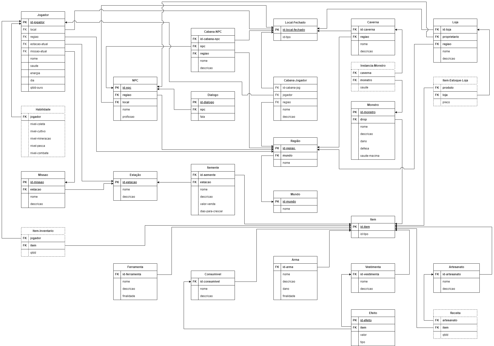

## Histórico de versões

| Versão |    Data    | Descrição                 | Autor                                                                                                                                                                                                                                     |
| :----: | :--------: | ------------------------- | ----------------------------------------------------------------------------------------------------------------------------------------------------------------------------------------------------------------------------------------- |
| `1.0`  | 23/09/2023 | Criação do documento MREL | [Zenilda Vieira](https://github.com/ZenildaVieira)                                                                                                                                                                                        |
| `1.1`  | 23/09/2023 | Primeira versão do MREL   | [Edilberto Cantuaria](https://github.com/edilbertocantuaria),   [Marcus Martins](https://github.com/marcusmartinss),   [Matheus Silverio](https://github.com/MattSilverio),   [Zenilda Vieira](https://github.com/ZenildaVieira) |
| `1.2`  | 24/09/2023 | Descrição do documento    | [Matheus Silverio](https://github.com/MattSilverio)                                                                                                                                                                                       |
| `1.3`  | 26/09/2023 | Revisão em pares          | [Edilberto Cantuaria](https://github.com/edilbertocantuaria),   [Zenilda Vieira](https://github.com/ZenildaVieira)                                                                                                                     |

# Modelo Relacional

  
O Modelo Relacional(MREL) apresenta um diagrama lógico de como as entidades e seus relacionamentos serão mapeados no banco de dados. Esse artefato é um modelo não atrelado a nenhum sistema de gerenciamento de banco de dados (SGBD) específico.

 

    
Figura 1: MREL Stardew Valley

    
Fonte: Autores

